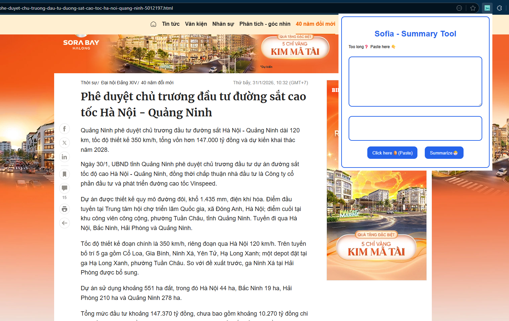
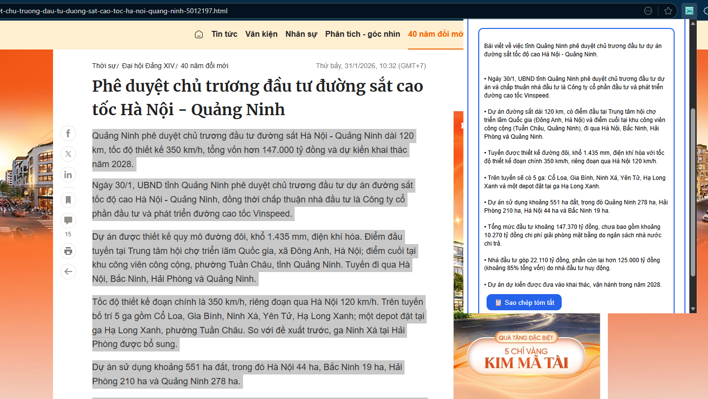
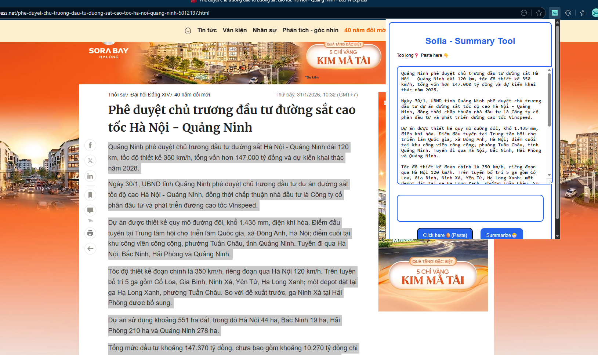

# Sofia - AI Text Summarizer Extension


A smart browser extension that summarizes long texts using AI. Supports Vietnamese and English with clean bullet-point formatting.

## Introduce
promote/small.png

## ✨ Features

- ** AI-Powered Summaries**: Uses DeepSeek AI for accurate text summarization
- ** Smart Clipboard**: One-click paste from clipboard
- ** Bullet-Point Format**: Clean, structured summaries with bullet points
- ** Support Multiple Languages**: Input any language, output Vietnamese
- ** Fast Processing**: Cloudflare Worker backend for quick responses
- ** Privacy Focused**: Your data is not stored or shared

## Screenshots

| Extension Popup | Summary Result | Clipboard Paste |
|----------------|----------------|----------------|
|  |  |  |

## Installation

### Microsoft Edge
1. Visit [Edge Add-ons Store](#) (Coming soon)
2. Click "Get" to install
3. Pin extension to toolbar

### Google Chrome
1. Visit [Chrome Web Store](#) (Coming soon)
2. Click "Add to Chrome"
3. Confirm installation

### Manual Installation (Developers)
```bash
# Clone repository
git clone https://github.com/yourusername/sofia-text-summarizer.git

# Load in browser
1. Open edge://extensions/ or chrome://extensions/
2. Enable "Developer mode"
3. Click "Load unpacked"
4. Select the 'src' folder